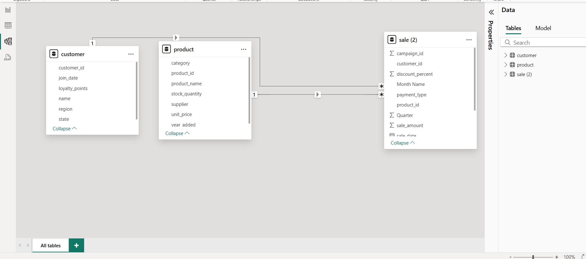
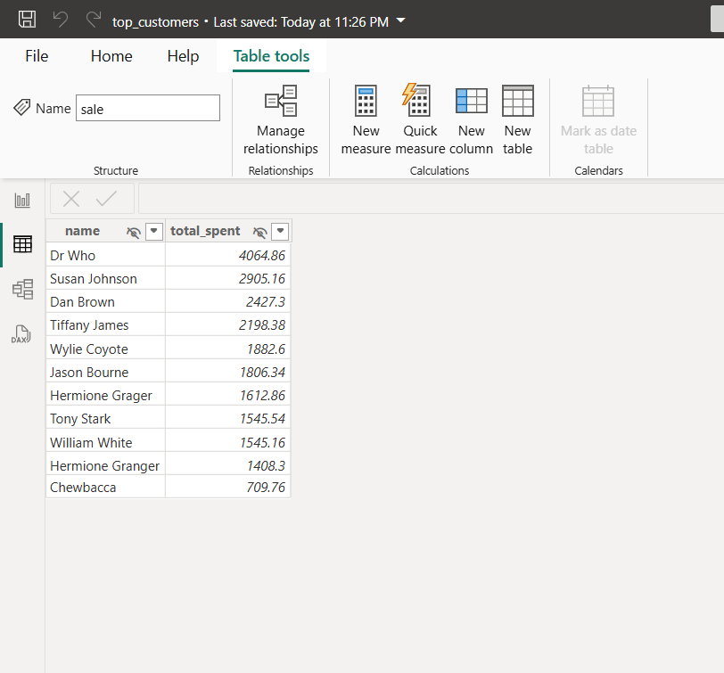
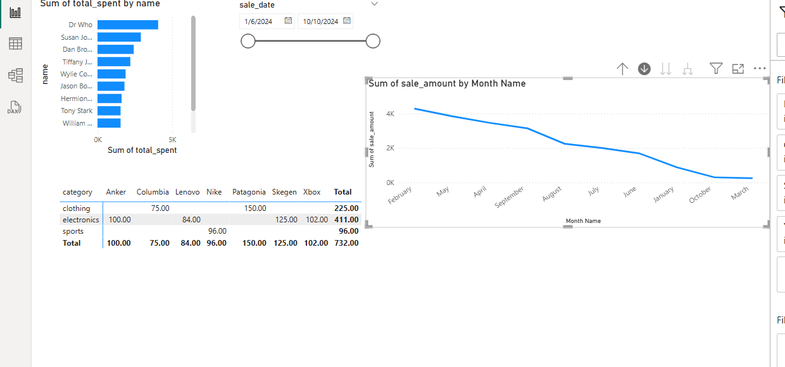

# smart-store-aanchal
# smart-sales-starter-files

Starter files to initialize the smart sales project.

-----

## Project Setup Guide (1-Mac/Linux)

Run all commands from a terminal in the root project folder. 

### Step 1A - Create a Local Project Virtual Environment

```shell
python3 -m venv .venv
```

### Step 1B - Activate the Virtual Environment

```shell
source .\.venv\scripts\activate
```

### Step 1C - Install Packages

```shell
python3 -m pip install --upgrade -r requirements.txt
```

### Step 1D - Optional: Verify .venv Setup

```shell
python3 -m datafun_venv_checker.venv_checker
```

### Step 1E - Run the initial project script

```shell
python3 scripts/data_prep.py
```

-----

## Project Setup Guide (2-Windows)

Run all commands from a PowerShell terminal in the root project folder.

### Step 2A - Create a Local Project Virtual Environment

```shell
py -m venv .venv
```

### Step 2B - Activate the Virtual Environment

```shell
.venv\Scripts\activate
```

### Step 2C - Install Packages

```shell
py -m pip install --upgrade -r requirements.txt
```

### Step 2D - Optional: Verify .venv Setup

```shell
py -m datafun_venv_checker.venv_checker
```

### Step 2E - Run the initial project script

```shell
py scripts/data_prep.py
```

-----

## Initial Package List

- pip
- loguru
- ipykernel
- jupyterlab
- numpy
- pandas
- matplotlib
- seaborn
- plotly
- pyspark==4.0.0.dev1
- pyspark[sql]
- git+https://github.com/denisecase/datafun-venv-checker.git#egg=datafun_venv_checker


## Create scripts data_scrubber.py and data_prep.py

```
    Copy file contents from starter repo provided


## Create tests folder and script file test_data_scrubber.py
    Copy file contents from starter repo provided

## Execute test script to confirm data_scrubber.py runs without error

    python tests/test_data_scrubber.py
```

## Create data warehouse and database tables
##### The data warehouse will use a star schema consisting of two dimension tables (customer and product) and one fact table (sale).
```shell
py scripts\etl_to_dw.py
```
## P5. Cross-Platform Reporting with Power BI & Spark

### connecting to data warehouse and seeing tables connection


### Move to Power BI and analyze data
Here, we move to analyzing our data using SQL through PowerBI. In this example, we sum total sales per person to determine the top customers.

```shell
let
    Source = Odbc.Query("dsn=SmartSalesDSN", 
        "
        SELECT c.name, SUM(s.sale_amount) AS total_spent 
        FROM sale s 
        JOIN customer c ON s.customer_id = c.customer_id 
        GROUP BY c.name 
        ORDER BY total_spent DESC
        "
    )
in
    Source


```


### implement slicing, dicing, and drilldown techniques to analyze sales.



## Custom BI project
### Section 1. The Business Goal
Determine the top-performing product in terms of profit by month and region.

### Section 2. Data Source
Data Warehouse : data/dw/smart_sales.db

### Section 3. Tools Used
- Python scripts to handle transforming/cleaning data
- SQLite3 for the database
- Power BI to create the dashboard


### Section 4. Workflow & Logic
-  combined the sales, product and customer data into all_data. Since the region info was in the customer data, it helped me break things down. Then, I calculated the total sales amount for each product by month and region.

Tables: sales, customer, product combined to all_data
Columns: product_id, customer_id, sale_date, sale_amount, region, product_name, category, month, month_name, quarter, Year
Workflow: Aggregate by product name and region category, calculate total sales per month
Output: Clustered Column chart + summary table


### Section 5. Results (narrative + visualizations)

- South region has the highest total sales overall, especially for  Hoodies and Jackets, meaning these products are popular here.  
- North region also performs well, especially for Jackets and Football  items.  
- Cable and Hat products have low sales across most regions, suggesting they're not as popular.  
  
### Section 6. Suggested Business Action
Focus marketing and inventory on Hoodies and Jackets in the South and North. Reduce stock or promotions for Cables and Hats to avoid overstock.
- 
### Section 7. Challenges
- Figuring out which visualizations to utilize
- Properly displaying each chart with the correct features

### Section 8. Ethical Considerations
ensuring all regions have fair access to good products, support, and deals. When boosting top-performing areas, also find ways to support underrepresented ones


## Git Workflow

After making changes, use the following commands to commit and push updates to GitHub:

    # git add .
    # git commit -m "Update README with custom BI project details"
    # git push
